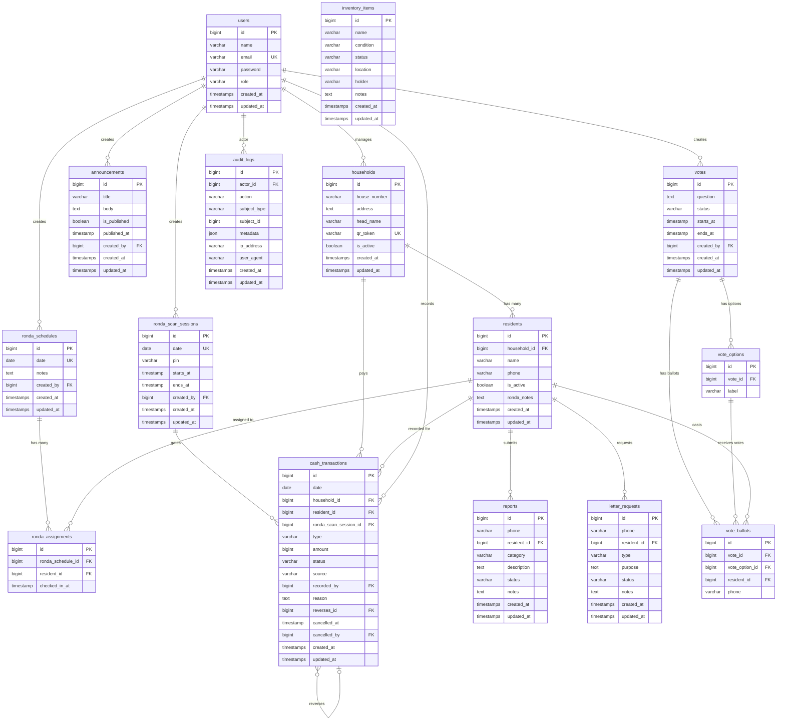
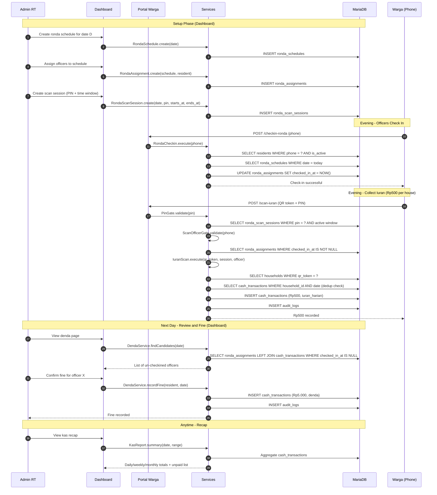
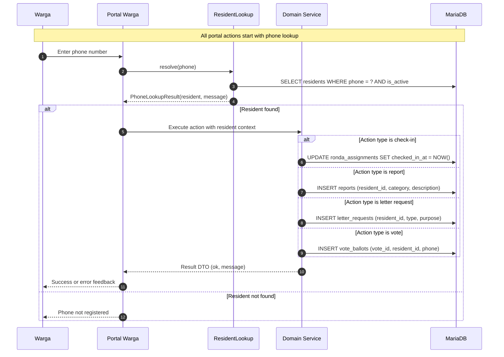
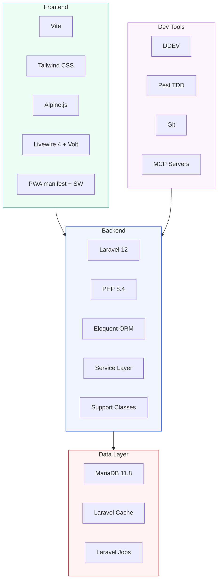

# Smart RT — Architecture Diagrams

> Render these diagrams in any Mermaid-compatible viewer (VS Code Mermaid extension, GitHub, GitLab, etc.)

---

## 1. High-Level Architecture

```mermaid
graph TB
    subgraph Users["Users"]
        Warga["Warga - Residents"]
        Pengurus["Pengurus - Board"]
    end

    subgraph Portal["Portal Warga - Public No Login"]
        PHome["/ Home"]
        PVerify["/cek-nomor"]
        PRonda["/jadwal-ronda"]
        PCheckin["/checkin-ronda"]
        PScan["/scan-iuran"]
        PAnnounce["/pengumuman"]
        PReport["/lapor"]
        PLetter["/surat"]
        PVotes["/voting"]
    end

    subgraph Dashboard["Dashboard Pengurus - Login + Role Gate"]
        DIndex["/dashboard"]
        DHousehold["/dashboard/rumah"]
        DResident["/dashboard/warga"]
        DRonda["/dashboard/ronda"]
        DScan["/dashboard/sesi-scan"]
        DDenda["/dashboard/denda"]
        DKas["/dashboard/kas"]
        DAnnounce["/dashboard/pengumuman"]
        DReport["/dashboard/laporan"]
        DLetter["/dashboard/surat"]
        DVotes["/dashboard/voting"]
        DInventory["/dashboard/inventaris"]
    end

    subgraph Services["Service Layer"]
        ResidentLookup["ResidentLookup"]
        RondaCheckin["RondaCheckin"]
        IuranScan["IuranScan"]
        DendaService["DendaService"]
        KasReport["KasReport"]
        TransactionCorrection["TransactionCorrection"]
        VotingService["VotingService"]
        PinGate["PinGate"]
        ScanOfficerGate["ScanOfficerGate"]
        AdminDashboardSummary["AdminDashboardSummary"]
    end

    subgraph Support["Support Classes"]
        PhoneNumber["PhoneNumber"]
        Audit["Audit"]
        QrCode["QrCode"]
        AnnouncementHtml["AnnouncementHtml"]
    end

    subgraph Models["Eloquent Models"]
        User["User"]
        Household["Household"]
        Resident["Resident"]
        RondaSchedule["RondaSchedule"]
        RondaAssignment["RondaAssignment"]
        RondaScanSession["RondaScanSession"]
        CashTransaction["CashTransaction"]
        Announcement["Announcement"]
        Report["Report"]
        LetterRequest["LetterRequest"]
        Vote["Vote"]
        VoteOption["VoteOption"]
        VoteBallot["VoteBallot"]
        InventoryItem["InventoryItem"]
        AuditLog["AuditLog"]
    end

    subgraph DB["MariaDB 11.8"]
        TUsers["users"]
        THouseholds["households"]
        TResidents["residents"]
        TRondaSchedules["ronda_schedules"]
        TRondaAssignments["ronda_assignments"]
        TRondaScanSessions["ronda_scan_sessions"]
        TCashTransactions["cash_transactions"]
        TAnnouncements["announcements"]
        TReports["reports"]
        TLetterRequests["letter_requests"]
        TVotes["votes"]
        TVoteOptions["vote_options"]
        TVoteBallots["vote_ballots"]
        TInventoryItems["inventory_items"]
        TAuditLogs["audit_logs"]
    end

    Warga --> Portal
    Pengurus --> Dashboard
    Portal --> Services
    Dashboard --> Services
    Services --> Models
    Support --> Services
    Models --> DB

    style Portal fill:#ecfdf5,stroke:#059669,stroke-width:2px
    style Dashboard fill:#eff6ff,stroke:#2563eb,stroke-width:2px
    style Services fill:#fefce8,stroke:#ca8a04,stroke-width:2px
    style Support fill:#fdf4ff,stroke:#9333ea,stroke-width:2px
    style DB fill:#fef2f2,stroke:#dc2626,stroke-width:2px
```

---

## 2. Entity-Relationship Diagram

---

## 3. Data Flow — Kas and Ronda

---

## 4. Data Flow — Resident Portal Actions

---

## 5. Route Map

```mermaid
graph LR
    subgraph Public["Public Routes (No Auth)"]
        HOME["/ portal.home"]
        VERIFY["/cek-nomor portal.verify"]
        RONDA["/jadwal-ronda portal.ronda (feature:ronda)"]
        CHECKIN["/checkin-ronda portal.checkin (feature:ronda)"]
        SCAN["/scan-iuran portal.scan (feature:kas)"]
        ANNOUNCE["/pengumuman portal.announcements (feature:announcements)"]
        REPORT["/lapor portal.report (feature:reports)"]
        LETTER["/surat portal.letter (feature:letters)"]
        VOTE_LIST["/voting portal.votes (feature:voting)"]
        VOTE_DETAIL["/voting id portal.vote (feature:voting)"]
    end

    subgraph Auth["Auth Route"]
        LOGIN["/login auth.login"]
    end

    subgraph DashboardRoutes["Dashboard Routes (auth + pengurus middleware)"]
        DASH["/dashboard dashboard.index"]
        HH["/dashboard/rumah households.index"]
        HHQR["/dashboard/rumah id qr households.qr"]
        RES["/dashboard/warga residents.index"]
        SETTINGS["/dashboard/pengaturan settings.index (admin_rt only)"]
        RONDA_MGR["/dashboard/ronda ronda.index (feature:ronda)"]
        RONDA_DETAIL["/dashboard/ronda id ronda.show (feature:ronda)"]
        SCAN_MGR["/dashboard/sesi-scan scan.index (feature:ronda)"]
        DENDA["/dashboard/denda denda.index (feature:ronda)"]
        KAS["/dashboard/kas kas.index (feature:kas)"]
        KAS_TX["/dashboard/kas/transaksi kas.transactions (feature:kas)"]
        ANN_MGR["/dashboard/pengumuman announcements.index (feature:announcements)"]
        REPORT_MGR["/dashboard/laporan reports.index (feature:reports)"]
        LETTER_MGR["/dashboard/surat letters.index (feature:letters)"]
        VOTE_MGR["/dashboard/voting votes.index (feature:voting)"]
        VOTE_RESULT["/dashboard/voting id votes.show (feature:voting)"]
        INV["/dashboard/inventaris inventory.index (feature:inventory)"]
    end

    style Public fill:#ecfdf5,stroke:#059669
    style Auth fill:#fefce8,stroke:#ca8a04
    style DashboardRoutes fill:#eff6ff,stroke:#2563eb
```

---

## 6. Technology Stack

---

*Generated for Smart RT — 2026-06-18*
